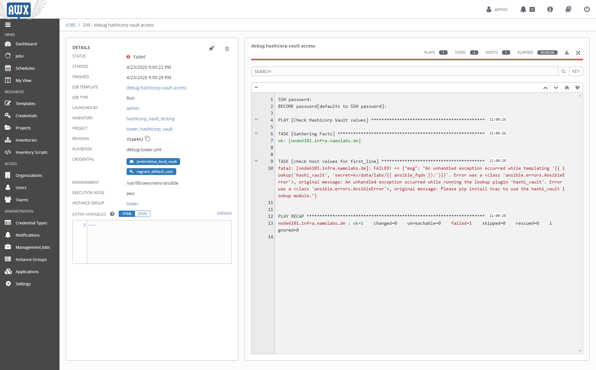
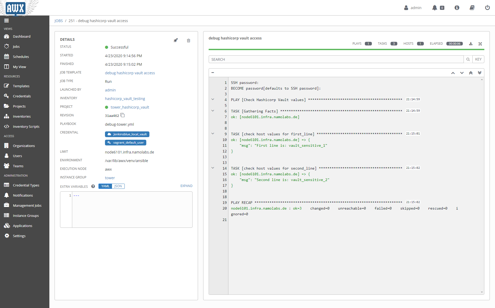

### Policy for token used

```hcl
path "kv/data/labs/node6101" {
  capabilities = ["read"]
}
```


```console
[root@docker01 ansible-tower-hashicorp-vault]# export VAULT_TOKEN="SOMETOKEN"
[root@docker01 ansible-tower-hashicorp-vault]# ansible-playbook -i inventory -u vagrant -k -b debug.yml -e vault_token=$VAULT_TOKEN -b
SSH password: 

PLAY [Check Hashicorp Vault values] **********************************************************************************************************************************************************

TASK [Gathering Facts] ***********************************************************************************************************************************************************************
ok: [node6101]

TASK [check host values for first_line] ******************************************************************************************************************************************************
fatal: [node6101]: FAILED! => {"msg": "An unhandled exception occurred while templating '{{ lookup('hashi_vault', 'secret=secret/data/{{ ansible_fqdn }}: token={{ vault_token | mandatory }}')}}'. Error was a <class 'ansible.errors.AnsibleError'>, original message: An unhandled exception occurred while running the lookup plugin 'hashi_vault'. Error was a <class 'ansible.errors.AnsibleError'>, original message: Please pip install hvac to use the hashi_vault lookup module."}

PLAY RECAP ***********************************************************************************************************************************************************************************
node6101                   : ok=1    changed=0    unreachable=0    failed=1    skipped=0    rescued=0    ignored=0   

[root@docker01 ansible-tower-hashicorp-vault]# pip install hvac
bash: pip: command not found
[root@docker01 ansible-tower-hashicorp-vault]# pip3 install hvac
WARNING: Running pip install with root privileges is generally not a good idea. Try `pip3 install --user` instead.
Collecting hvac
  Downloading https://files.pythonhosted.org/packages/2f/89/24a696c1c31156f3d4b31c21741da5dc65d7617a08d73a06e6c7aec8bd88/hvac-0.10.1-py2.py3-none-any.whl (119kB)
    100% |████████████████████████████████| 122kB 1.7MB/s 
Requirement already satisfied: six>=1.5.0 in /usr/local/lib/python3.6/site-packages (from hvac)
Requirement already satisfied: requests>=2.21.0 in /usr/local/lib/python3.6/site-packages (from hvac)
Requirement already satisfied: idna<3,>=2.5 in /usr/local/lib/python3.6/site-packages (from requests>=2.21.0->hvac)
Requirement already satisfied: certifi>=2017.4.17 in /usr/local/lib/python3.6/site-packages (from requests>=2.21.0->hvac)
Requirement already satisfied: chardet<4,>=3.0.2 in /usr/local/lib/python3.6/site-packages (from requests>=2.21.0->hvac)
Requirement already satisfied: urllib3!=1.25.0,!=1.25.1,<1.26,>=1.21.1 in /usr/local/lib/python3.6/site-packages (from requests>=2.21.0->hvac)
Installing collected packages: hvac
Successfully installed hvac-0.10.1
```

### Access to non-existing secrets path

```console
[root@docker01 ansible-tower-hashicorp-vault]# ansible-playbook -i inventory -u vagrant -k -b debug.yml -e vault_token="s.nbiEdVB5tL2mwKUJBemz4K1i" -b
SSH password: 

PLAY [Check Hashicorp Vault values] **********************************************************************************************************************************************************

TASK [Gathering Facts] ***********************************************************************************************************************************************************************
ok: [node6101]

TASK [check host values for first_line] ******************************************************************************************************************************************************
fatal: [node6101]: FAILED! => {"msg": "An unhandled exception occurred while templating '{{ lookup('hashi_vault', 'secret=secret/data/{{ ansible_fqdn }}: token={{ vault_token | mandatory }}')}}'. Error was a <class 'ansible.errors.AnsibleError'>, original message: An unhandled exception occurred while running the lookup plugin 'hashi_vault'. Error was a <class 'hvac.exceptions.Forbidden'>, original message: 1 error occurred:\n\t* permission denied\n\n"}

PLAY RECAP ***********************************************************************************************************************************************************************************
node6101                   : ok=1    changed=0    unreachable=0    failed=1    skipped=0    rescued=0    ignored=0   

```

### Access with existing secrets path

```console
[root@docker01 ansible-tower-hashicorp-vault]# ansible-playbook -i inventory -u vagrant -k -b debug.yml -e vault_token=$VAULT_TOKEN -b
SSH password: 

PLAY [Check Hashicorp Vault values] **********************************************************************************************************************************************************

TASK [Gathering Facts] ***********************************************************************************************************************************************************************
ok: [node6101]

TASK [check host values for first_line] ******************************************************************************************************************************************************
ok: [node6101] => {
    "msg": "First line is: vault_sensitive_1"
}

TASK [check host values for second_line] *****************************************************************************************************************************************************
ok: [node6101] => {
    "msg": "Second line is: vault_sensitive_2"
}

PLAY RECAP ***********************************************************************************************************************************************************************************
node6101                   : ok=3    changed=0    unreachable=0    failed=0    skipped=0    rescued=0    ignored=0   

[root@docker01 ansible-tower-hashicorp-vault]# ansible-playbook -i inventory -u vagrant -k -b index_html_create.yml -e vault_token=$VAULT_TOKEN -b
SSH password: 

PLAY [Create index.html from template] *******************************************************************************************************************************************************

TASK [Gathering Facts] ***********************************************************************************************************************************************************************
ok: [node6101]

TASK [Create index.html] *********************************************************************************************************************************************************************
changed: [node6101]

PLAY RECAP ***********************************************************************************************************************************************************************************
node6101                   : ok=2    changed=1    unreachable=0    failed=0    skipped=0    rescued=0    ignored=0   

[root@docker01 ansible-tower-hashicorp-vault]# curl http://node6101
<body>
<h1>Apache is running fine</h1>
<h1>This is field "First Line": vault_sensitive_1</h1>
<h1>This is field "Second Line": vault_sensitive_2</h1>
</body>
```


## Test hashicorp vault access in awx/tower

Followed procedure described in README.adoc.

### python module hvac missing in standard awx installation

Got error message: "hvac missing"



### Install hvac on awx_task container

This is not supported!

The supported way is to create a separate custom venv and tell awx to use it. As a bonus, you are then able to have an organization, project or job template use a specific venv.

... but it worked for me :-)

See: [github/awx doc - Managing Custom Python Dependencies](https://github.com/ansible/awx/blob/devel/docs/custom_virtualenvs.md)


```console
docker exec -it awx_task /bin/bash
cd /var/lib/awx/venv/ansible/bin

source ./activate
(ansible) bash-4.4# pip3 install hvac
Collecting hvac
  Downloading https://files.pythonhosted.org/packages/2f/89/24a696c1c31156f3d4b31c21741da5dc65d7617a08d73a06e6c7aec8bd88/hvac-0.10.1-py2.py3-none-any.whl (119kB)
     |████████████████████████████████| 122kB 2.1MB/s 
Requirement already satisfied: requests>=2.21.0 in /var/lib/awx/venv/ansible/lib/python3.6/site-packages (from hvac) (2.22.0)
Requirement already satisfied: six>=1.5.0 in /var/lib/awx/venv/ansible/lib/python3.6/site-packages (from hvac) (1.13.0)
Requirement already satisfied: urllib3!=1.25.0,!=1.25.1,<1.26,>=1.21.1 in /var/lib/awx/venv/ansible/lib/python3.6/site-packages (from requests>=2.21.0->hvac) (1.25.7)
Requirement already satisfied: certifi>=2017.4.17 in /var/lib/awx/venv/ansible/lib/python3.6/site-packages (from requests>=2.21.0->hvac) (2019.11.28)
Requirement already satisfied: chardet<3.1.0,>=3.0.2 in /var/lib/awx/venv/ansible/lib/python3.6/site-packages (from requests>=2.21.0->hvac) (3.0.4)
Requirement already satisfied: idna<2.9,>=2.5 in /var/lib/awx/venv/ansible/lib/python3.6/site-packages (from requests>=2.21.0->hvac) (2.8)
Installing collected packages: hvac
Successfully installed hvac-0.10.1
WARNING: You are using pip version 19.3.1; however, version 20.0.2 is available.
You should consider upgrading via the 'pip install --upgrade pip' command.
(ansible) bash-4.4# exit
exit
```

## Tower

After creating a credential type and a credential of this type (see README.adoc), the test in awx/tower worked nicely




